# Associate 360 Platform - Complete Workflow Diagrams

## Overview

This document outlines all major process flows within the Associate 360 Platform, providing detailed workflow diagrams for each core business process from job creation to final clearance.

## 1. Job Creation and Approval Workflow

### Manager Job Creation Process

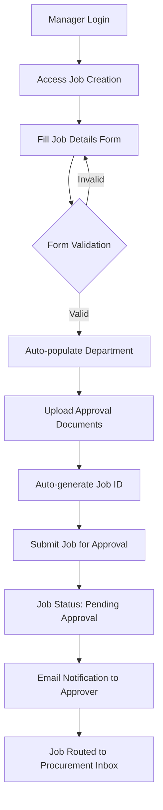

### Job Approval Workflow

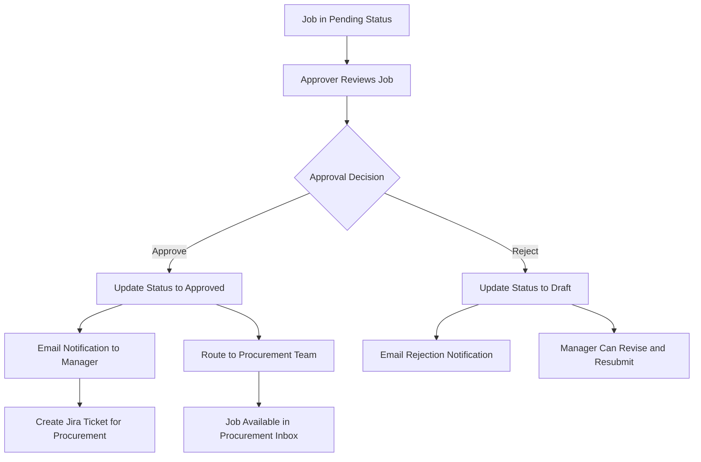

### Procurement Processing

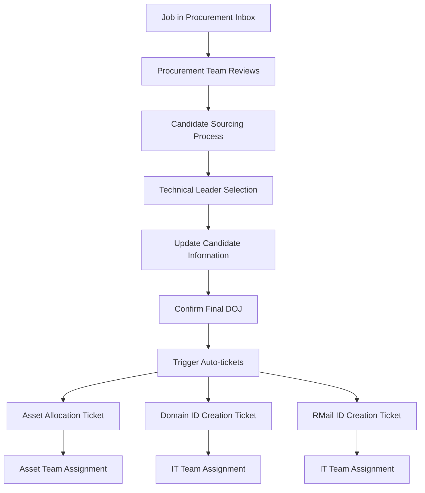

## 2. Associate Onboarding Process

### Complete Onboarding Workflow

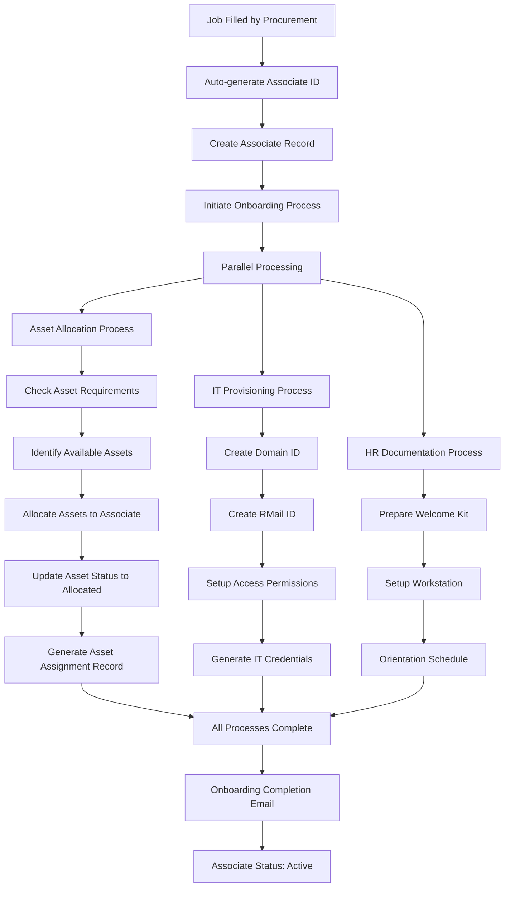

### Asset Allocation Sub-process

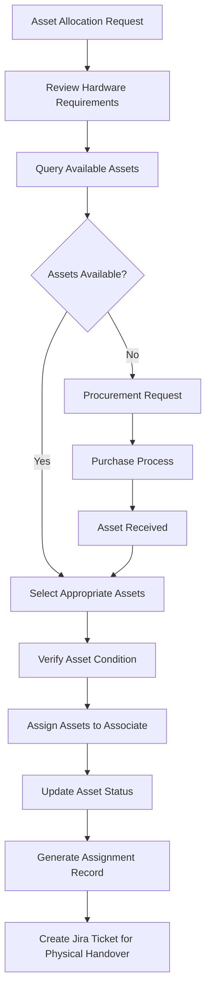

## 3. Attendance and Leave Management

### Daily Attendance Process

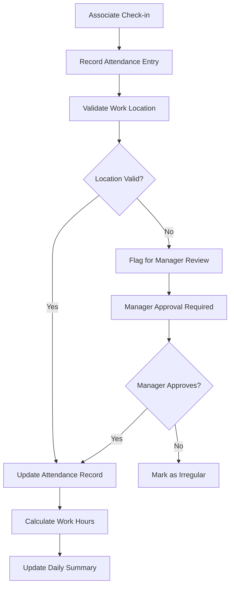

### Leave Application Process

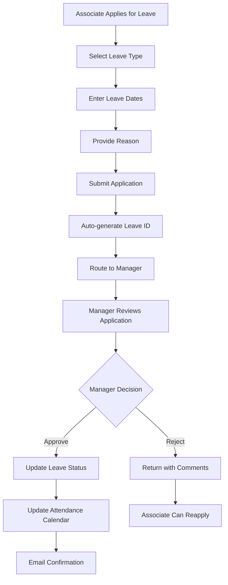

## 4. Asset Management Workflow

### Asset Lifecycle Management

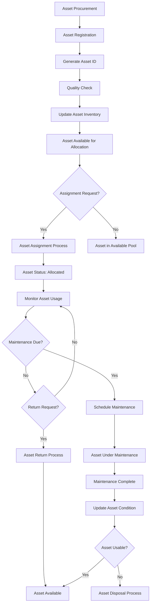

### Asset Return and Recovery

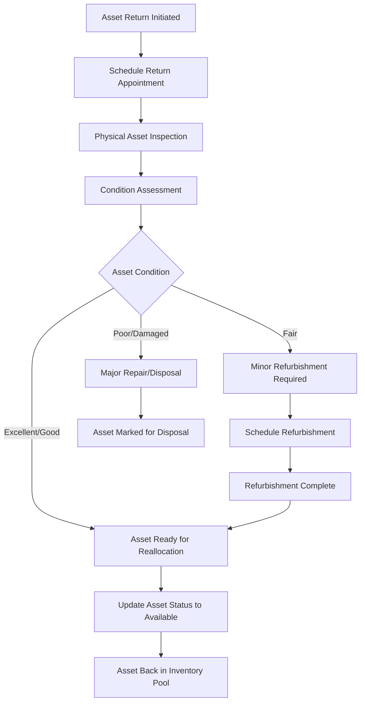

## 5. Resignation and Offboarding Process

### Resignation Initiation

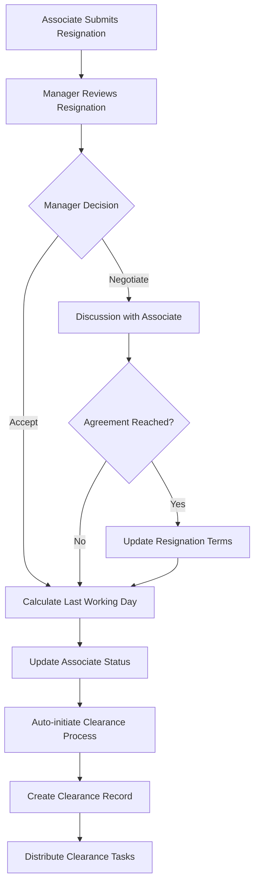

### Comprehensive Clearance Process

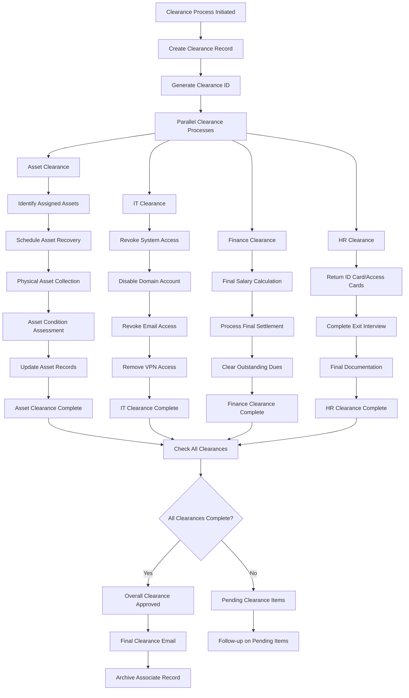

## 6. Bulk Clearance Process

### Template-based Bulk Processing

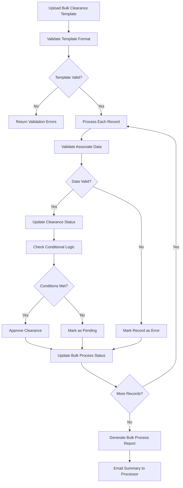

## 7. Automated Notification System

### Email Notification Triggers

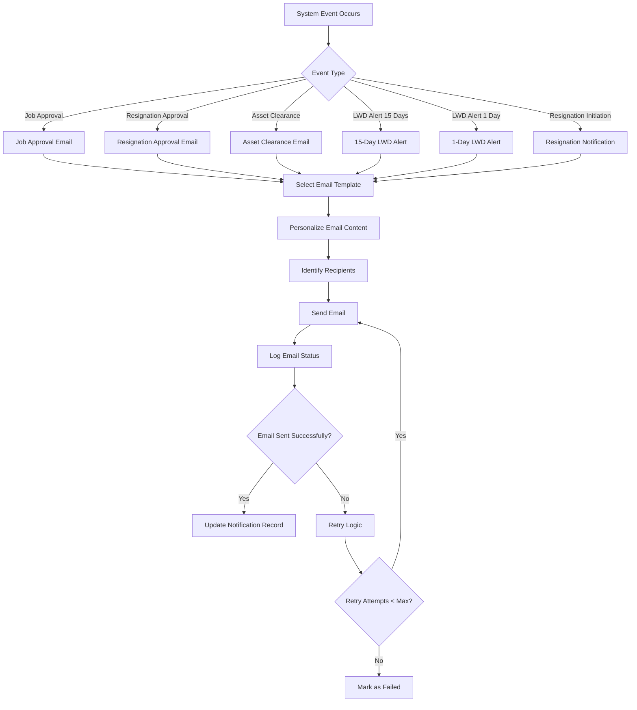

## 8. Integration Workflows

### Jira Integration Process

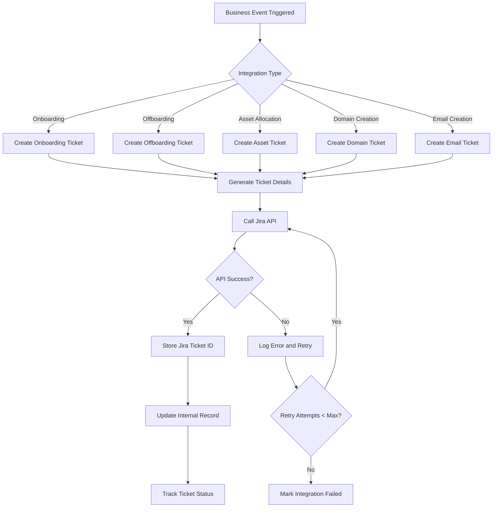

### Asset Portal Synchronization

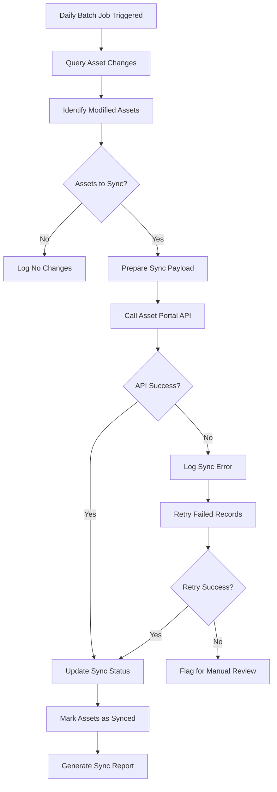

## 9. Reporting and Analytics Workflow

### Real-time Dashboard Updates

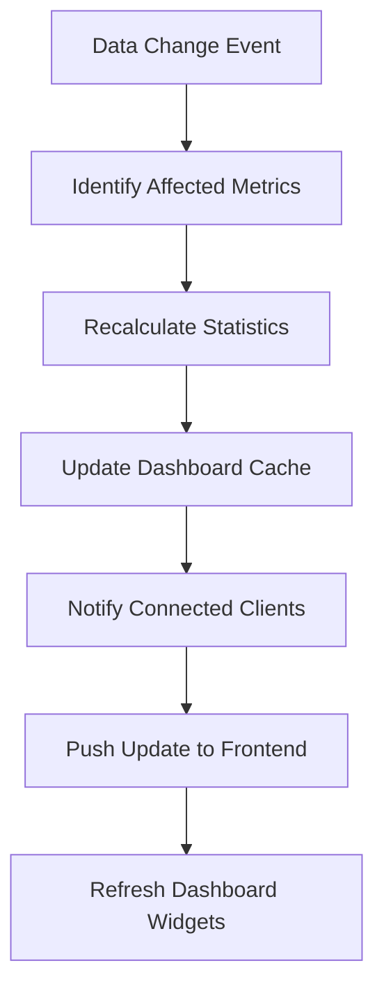

### Scheduled Report Generation

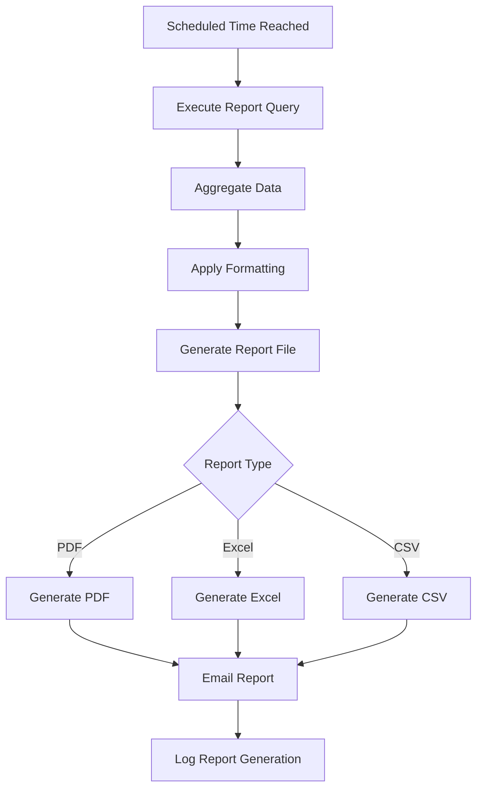

## 10. Error Handling and Recovery

### System Error Recovery

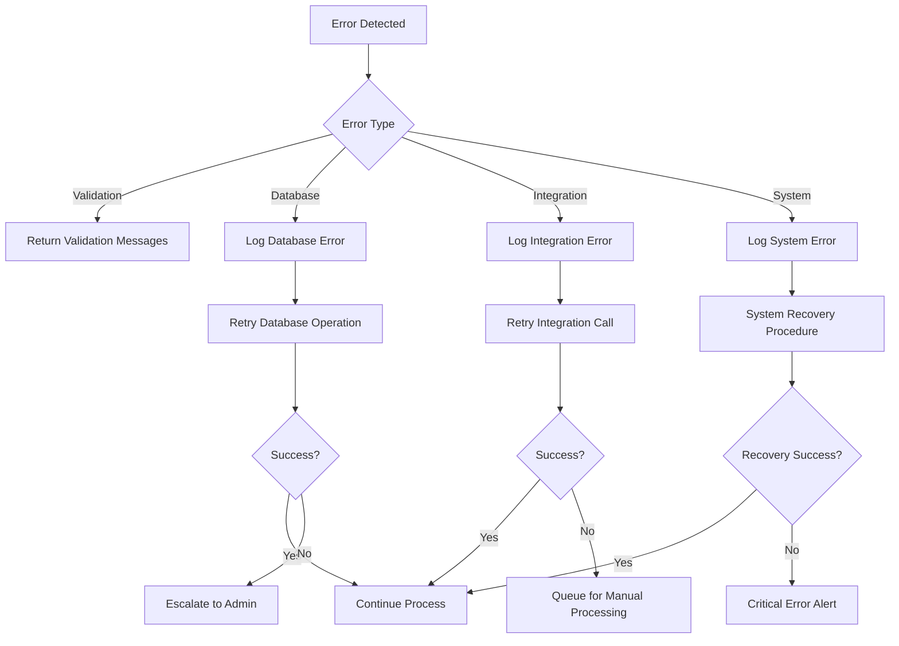

This comprehensive workflow documentation provides detailed process flows for all major operations within the Associate 360 Platform, ensuring clear understanding of business processes and system interactions.